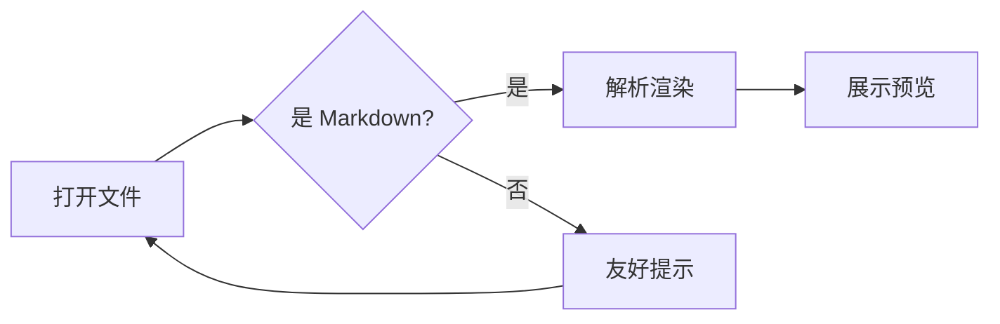
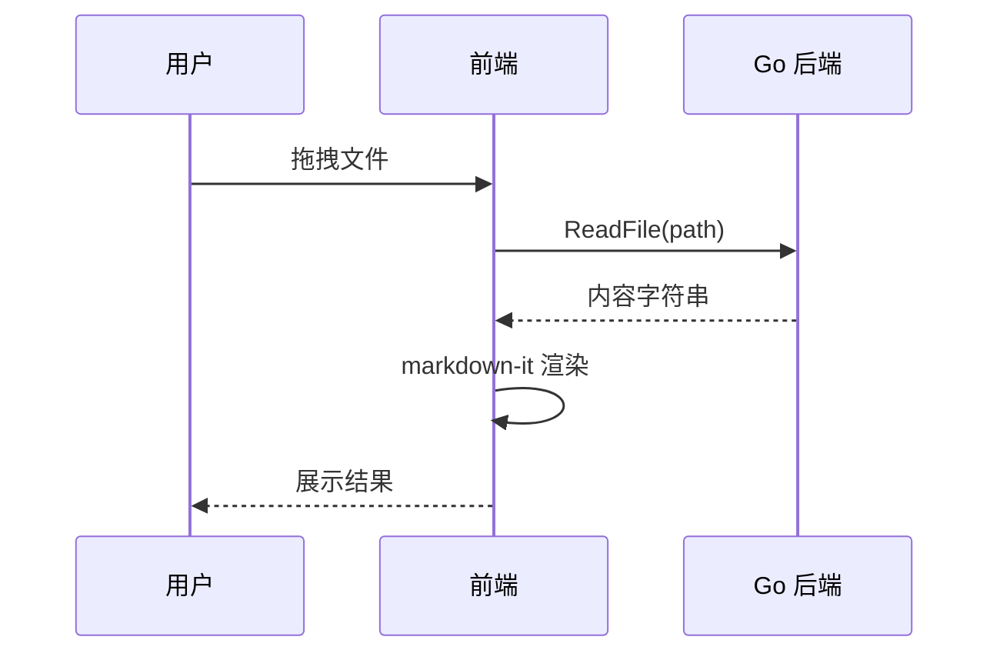
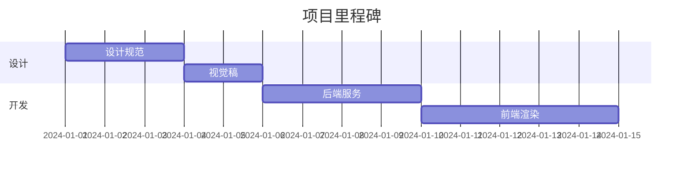

# Markdown 预览器 · 综合测试样例

> 本文件用于验收测试：覆盖 GFM 全特性、代码高亮、KaTeX、mermaid 与安全边界。所有渲染结果以 [CommonMark](https://commonmark.org/) 与 GitHub 风格为基准。

## 1. 标题与段落

### 1.1 中文排版

这是一段**中文**与 *English* 混排的测试文本，包含 `行内代码`、~~删除线~~、<u>下划线(HTML)</u> 与 [链接](https://example.com)。

第二段验证软换行（行尾两个空格 → 换行）：  
这里是换行后的内容。

### 1.2 自动链接

- 网址：https://example.com/docs
- 邮箱：<dev@example.com>
- 引用式链接 [参考][ref]

[ref]: https://example.com/ref "引用式链接"

## 2. 列表与任务

1. 有序列表第一项
2. 有序列表第二项
   1. 嵌套有序 a
   2. 嵌套有序 b
3. 第三项

- 无序项目一
- 无序项目二
  - 嵌套子项
    - 深嵌套子项
- 无序项目三

- [x] 已完成任务
- [ ] 未完成任务
- [ ] 另一个未完成

## 3. 表格

| 功能 | 支持 | 备注 |
| :--- | :---: | ---: |
| 表格 | ✅ | 左对齐 |
| 任务列表 | ✅ | 居中 |
| 删除线 | ~~不支持~~ ✅ | 右对齐 |
| 转义管道 `\|` | ✅ | 单元格内 `a\|b` |

## 4. 引用与代码

> 引用块第一层
>
> > 嵌套引用
> >
> > - 引用内列表
>
> 引用内代码：`const x = 1`

```javascript
// JavaScript 高亮示例
async function fetchData(url, { retries = 3 } = {}) {
  for (let i = 0; i < retries; i++) {
    try {
      const res = await fetch(url);
      if (!res.ok) throw new Error(`HTTP ${res.status}`);
      return await res.json();
    } catch (err) {
      if (i === retries - 1) throw err;
    }
  }
}
```

```go
// Go 高亮示例
func main() {
	ctx, cancel := context.WithTimeout(context.Background(), 5*time.Second)
	defer cancel()

	ch := make(chan int, 10)
	go func() { defer close(ch); for i := 0; i < 10; i++ { ch <- i } }()

	for v := range ch {
		fmt.Println(v)
	}
}
```

```rust
fn main() {
    let numbers: Vec<i32> = (1..=100).filter(|n| n % 15 == 0).collect();
    println!("{:?}", numbers);
}
```

```python
def fibonacci(n: int) -> list[int]:
    a, b = 0, 1
    result = []
    for _ in range(n):
        result.append(a)
        a, b = b, a + b
    return result
```

```bash
#!/usr/bin/env bash
set -euo pipefail
for file in ./docs/*.md; do
  echo "Processing: $file"
done
```

```sql
SELECT u.name, COUNT(o.id) AS orders
FROM users u
LEFT JOIN orders o ON o.user_id = u.id
WHERE u.created_at > '2024-01-01'
GROUP BY u.name
HAVING COUNT(o.id) > 5
ORDER BY orders DESC;
```

```diff
- const oldValue = 'deprecated';
+ const newValue = 'modern';
```

无语言标注的代码块：
```
<hello world>
```

## 5. 数学公式（KaTeX，可开关）

行内公式：质能方程 $E = mc^2$，欧拉恒等式 $e^{i\pi} + 1 = 0$。

块级公式：

$$
\int_{-\infty}^{\infty} e^{-x^2} \, dx = \sqrt{\pi}
$$

矩阵与分式：

$$
\begin{pmatrix} a & b \\ c & d \end{pmatrix}^{-1}
= \frac{1}{ad - bc} \begin{pmatrix} d & -b \\ -c & a \end{pmatrix}
$$

## 6. 图表（mermaid，可开关）







## 7. 脚注与更多

CommonMark 支持脚注[^1]，这里引用第二次[^1]，还可以多个[^2]。

[^1]: 这是脚注一的说明文字。
[^2]: 这是脚注二的说明文字，支持 *格式化* 与 `代码`。

---

分隔线以上是主要用例。下面是安全边界用例（**不应执行**）：

## 8. 安全用例（XSS）

```html
<script>alert('xss')</script>

<a href="javascript:alert(1)">javascript 链接</a>
<iframe src="https://example.com"></iframe>
```

行内注入测试：<script>alert(1)</script> 与  应显示为纯文本或清洗后的标签，**绝不执行**。

## 9. 结尾

> 验收通过标准：以上各节渲染结果正确、无脚本执行、明暗主题下观感一致。
